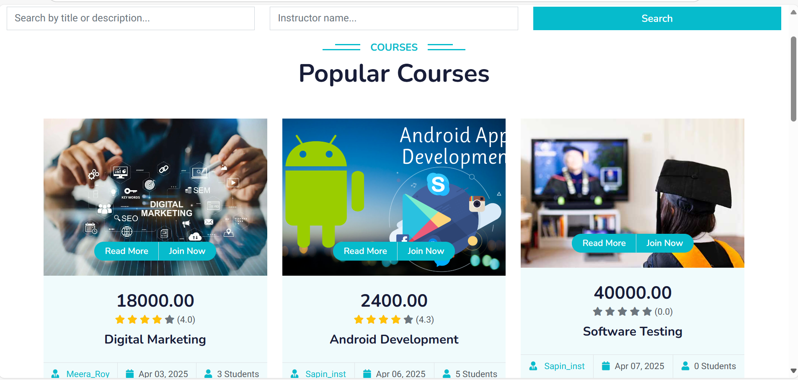
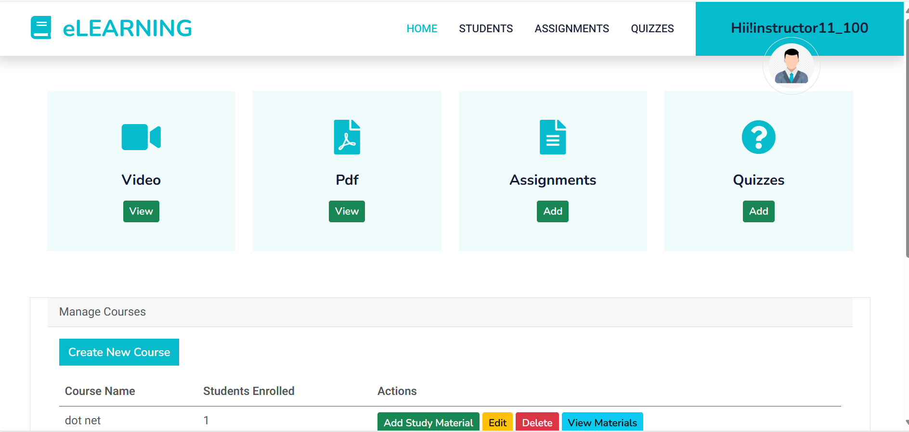
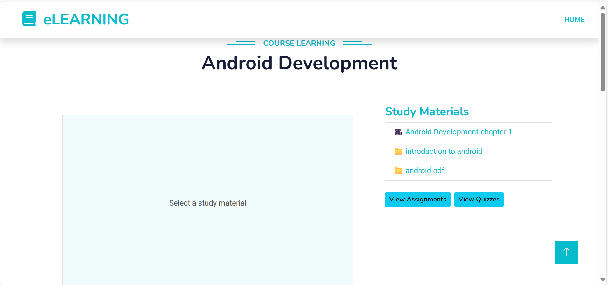
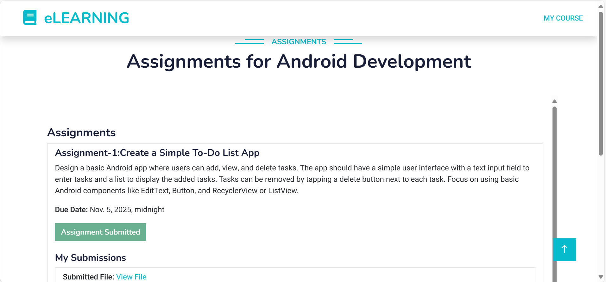
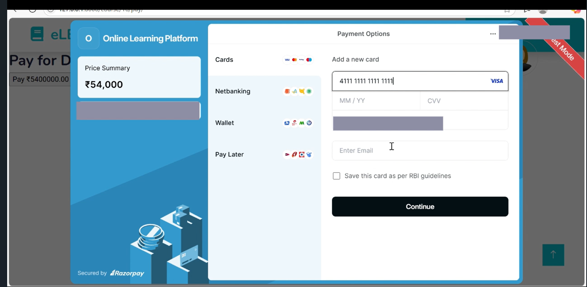
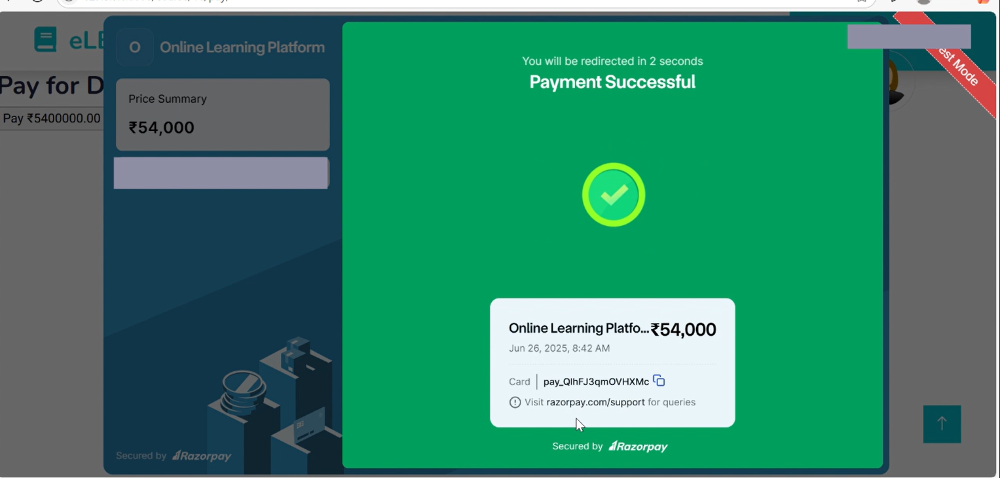

# 🎓 eLearning – Online Learning Platform (Django)

**eLearning** is a Django-based online learning platform that allows students to browse, enroll in, and now **pay for courses securely** via Razorpay. Instructors can create and manage courses, while students enjoy a smooth learning experience.

> 🔔 Now with Razorpay Payment Gateway Integration – supports paid course enrollment (test mode).

---

## 🚀 Features

- 🔐 User Authentication (Student / Instructor roles)
- 🎓 Course Creation by Instructors
- 📚 Course Enrollment by Students
- 💳 Razorpay Payment Integration (Test Mode)
- 📅 Task and Progress Tracking (optional feature)
- 📥 Responsive UI with Bootstrap
- 📦 Django Admin Panel for managing users and courses

---

## 💳 Razorpay Payment Integration

Razorpay has been integrated to allow secure payments for courses. Currently, the integration is in **test mode** using Razorpay's sandbox environment.

### ✔️ Payment Flow:
1. Student selects a paid course
2. Clicks “**Pay Now**” → Razorpay popup appears
3. Enters test card details
4. On success, enrollment is confirmed

> Test card: `4111 1111 1111 1111` | Any future expiry | Any CVV

---

## 🛠 Tech Stack

- **Backend:** Django, Python
- **Frontend:** HTML, CSS, Bootstrap
- **Payments:** Razorpay Payment Gateway
- **Database:** SQLite (development)
- **Deployment:** PythonAnywhere / Localhost

---

## 🖥️ Demo Video

🎥 [LinkedIn Post with Demo](#) *(https://www.linkedin.com/posts/jeena-v_django-razorpay-paymentgateway-activity-7343873528464601089-PJdE?utm_source=share&utm_medium=member_desktop&rcm=ACoAABfJWJ8BiXNGeGlXlNA1_pCDHLH6nntV-pY)*

---

## 📸 Screenshots


- ### 📘 index Page
 

- ### 📘 Course Listing Page
 

- ### 📘 Course Details Page
 

- ### 📘 Instructor Page
 

- ### 📘 Students Page
 

- ### 📘 Course Material Page
 

- ### 📘 Course Assignment Page
 

- ### 📘 Course Quiz Page
 

- ### 💳 Razorpay Payment Popup  
 

- - ### ✅ Payment Success Confirmation
 

---

## 🧪 How to Run Locally

Clone the repository and run on your local machine:

```bash
git clone https://github.com/jeena_v/eLearning.git
cd eLearning
pip install -r requirements.txt
python manage.py migrate
python manage.py runserver
